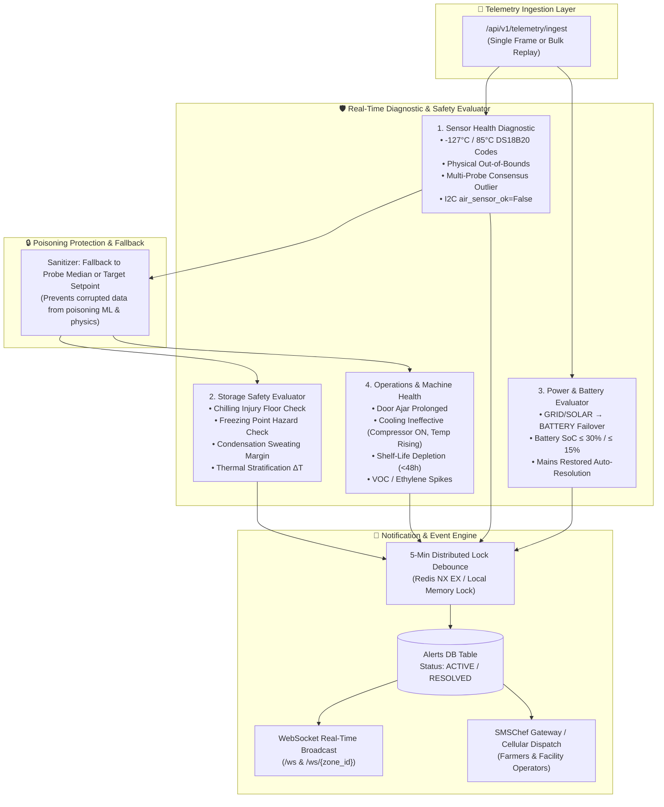

# 🚨 Solar Smart Cold Storage: Advanced Alert & Diagnostic System

This document provides a comprehensive technical reference for the enhanced **Alert & Diagnostic System** engineered for the **Solar-Powered Smart Mini Cold Storage System (NER)**.

The system protects perishable horticultural produce by monitoring storage physics, tracking solar/battery power transitions, isolating malfunctioning or disconnected IoT sensors, and dispatching targeted SMS/WhatsApp notifications to farmers and facility technicians.

---

## 📑 Table of Contents
1. [Architecture & Pipeline](#1-architecture--pipeline)
2. [Alert Catalog & Detection Logic](#2-alert-catalog--detection-logic)
   - [A. Unsafe Storage Conditions](#a-unsafe-storage-conditions)
   - [B. Power Transition & Battery Autonomy](#b-power-transition--battery-autonomy)
   - [C. Sensor Damage & Diagnostic Detection](#c-sensor-damage--diagnostic-detection)
   - [D. Cold Chain Operational & Machine Alerts](#d-cold-chain-operational--machine-alerts)
3. [Targeted Notification Routing](#3-targeted-notification-routing)
4. [Deduplication & Auto-Resolution Engine](#4-deduplication--auto-resolution-engine)
5. [REST API Reference & Data Models](#5-rest-api-reference--data-models)
6. [Testing & Verification Guide](#6-testing--verification-guide)

---

## 1. Architecture & Pipeline



---

## 2. Alert Catalog & Detection Logic

### A. Unsafe Storage Conditions
Storage safety is calibrated to ICAR & USDA horticultural parameters configured in [`config/storage_rules.yml`](file:///d:/Hackathon_2026/config/storage_rules.yml).

| Alert Type | Trigger Condition | Severity | Description & Protective Action |
| :--- | :--- | :---: | :--- |
| `CHILLING_INJURY_RISK` | Chamber Temp $<$ `zone.chilling_injury_c` | `WARNING` / `CRITICAL` | Detects when subtropical produce (e.g., French beans $< 5.0^\circ\text{C}$, Tomatoes $< 10.0^\circ\text{C}$, Mandarin $< 3.0^\circ\text{C}$) falls below the chilling floor. Prevents surface pitting, watery breakdown, and internal decay. |
| `FREEZING_HAZARD` | Chamber Temp $\le$ `zone.freezing_point_c` | `CRITICAL` | Detects when chamber temperature reaches freezing (e.g., Cabbage $\le -0.9^\circ\text{C}$, French bean $\le 0.0^\circ\text{C}$). Prevents ice crystal formation and cellular death. |
| `CONDENSATION_MOLD_HAZARD` | Margin ($T_{\text{surf}} - T_{\text{dew}}$) $\le 0.5^\circ\text{C}$ | `WARNING` / `CRITICAL` | Detects when produce skin temperature approaches or drops below dew point. Prevents water sweating on produce, which accelerates *Botrytis cinerea* (gray mold) germination. |
| `THERMAL_STRATIFICATION_HIGH` | Probe $\Delta T > 3.0^\circ\text{C}$ | `WARNING` | Detects large temperature differentials between multi-point spatial probes. Indicates fan failure, poor airflow, or blocked air ducts. |

---

### B. Power Transition & Battery Autonomy
Tracks solar generation, grid connectivity, and battery depletion in real-time.

| Alert Type | Trigger Condition | Severity | Description & Protective Action |
| :--- | :--- | :---: | :--- |
| `POWER_GRID_LOST` | Source switches from `GRID` or `SOLAR` to `BATTERY` | `WARNING` / `CRITICAL` | Detects grid power outage. Computes current battery SoC % and hours of autonomy remaining (e.g., *"Power outage: Switched to Battery. SoC: 22%, Autonomy: 2.0h"*). |
| `POWER_BATTERY_LOW` | On `BATTERY` and $\text{SoC} \le 30\%$ or autonomy $< 3\text{h}$ | `WARNING` | Alerts facility operator to check auxiliary generator or reduce non-critical cooling loads. |
| `POWER_BATTERY_CRITICAL` | On `BATTERY` and $\text{SoC} \le 15\%$ or autonomy $< 1\text{h}$ | `CRITICAL` | Imminent cold storage blackout and compressor shutdown. Requires urgent emergency power intervention. |
| `POWER_BLACKOUT_CRITICAL` | `power_source == 'NONE'` | `CRITICAL` | Total power failure. All active refrigeration has stopped. |
| `POWER_RESTORED` | Source transitions back to `GRID` or `SOLAR` | `INFO` | Notifies operators that main power is restored and battery is recharging. **Auto-resolves** active power outage alerts. |

---

### C. Sensor Damage & Diagnostic Detection
In rural cold storage units, sensor wires are exposed to condensation, rodent damage, and terminal corrosion. The system isolates corrupted sensors:

```
                  ┌──────────────────────────────────────────────┐
                  │          INCOMING SENSOR READING             │
                  └──────────────────────┬───────────────────────┘
                                         │
                   Is Reading == -127.0°C or == 85.0°C?
                                    /       \
                                  YES        NO
                                  /            \
          ┌───────────────────────────┐      Is Value Outside [-30°C, 60°C]?
          │ SENSOR_DISCONNECTED       │             /               \
          │ SENSOR_FAULT              │           YES                NO
          │ (DS18B20 1-Wire Wire Cut) │           /                    \
          └─────────────┬─────────────┘ ┌──────────────────────┐   Is 5-Probe Divergence > 6°C?
                        │               │ SENSOR_OUT_OF_BOUNDS │            /        \
                        │               │ (Broken Thermistor)  │          YES         NO
                        │               └──────────┬───────────┘          /             \
                        │                          │            ┌─────────────────┐ ┌─────────┐
                        │                          │            │PROBE_MALFUNCTION│ │ HEALTHY │
                        │                          │            │(Outlier Probe)  │ │ SENSOR  │
                        │                          │            └────────┬────────┘ └─────────┘
                        ▼                          ▼                     ▼
                  ┌─────────────────────────────────────────────────────────────┐
                  │                 SAFE FALLBACK SYSTEM                        │
                  │ • Mark Sensor DB Status = 'FAULT'                           │
                  │ • Substitute with Chamber Probe Median or Target Setpoint   │
                  │ • Prevent Corrupted Values from Poisoning AI/ML Models      │
                  └─────────────────────────────────────────────────────────────┘
```

1. **Digital 1-Wire Disconnect Codes (`SENSOR_DISCONNECTED`)**:
   - Detects `temperature <= -100.0°C` (the universal DS18B20 `-127.0°C` hardware disconnect code when wire is cut or pull-up lost).
   - Detects `temperature == 85.0°C` (`SENSOR_FAULT`, DS18B20 power-on reset state caused by conversion glitch or bus voltage drop).
2. **Out-of-Physical Bounds (`SENSOR_OUT_OF_BOUNDS`)**:
   - Temperature outside $[-30^\circ\text{C}, 60^\circ\text{C}]$.
   - Relative Humidity $\le 0.0\%$ or $> 100.0\%$ (sensing polymer flooded with liquid condensation).
   - CO₂ $< 100\text{ ppm}$ or $> 30,000\text{ ppm}$ (NDIR lamp burnt out or optics blocked).
3. **Edge Hardware Status Flags (`SENSOR_HARDWARE_FAULT` / `PROBE_FAULT`)**:
   - Hardware I2C bus failure: `air_sensor_ok == False`.
   - Probe array flags: `probe_status` containing `"FAULT"`, `"DISCONNECTED"`, or `"ERROR"`.
4. **Spatial Consensus Outliers (`PROBE_MALFUNCTION`)**:
   - Compares multi-probe temperature array against the median. If 4 probes read $1.5^\circ\text{C} \pm 0.3^\circ\text{C}$ and 1 probe reports $48^\circ\text{C}$, the system flags that specific probe index.
5. **Database Sensor Health Flagging & Model Protection**:
   - Updates `Sensor.status = 'FAULT'` and records `Sensor.last_fault`.
   - Safely substitutes invalid readings with the median of healthy probes or the chamber setpoint to prevent corrupted inputs from degrading ML and physics calculations.

---

### D. Cold Chain Operational & Machine Alerts

| Alert Type | Trigger Condition | Severity | Description |
| :--- | :--- | :---: | :--- |
| `DOOR_AJAR_WARNING` | `door_open == True` | `WARNING` | Cold storage door left open. Prevents thermal leakage and evaporator icing. Auto-resolves once the door is closed. |
| `COOLING_INEFFECTIVE` | Compressor ON but Temp $>$ `(zone.temp_max + 1.5°C)` | `CRITICAL` | Detects refrigeration failure / thermal runaway (refrigerant leak, failed compressor, or frozen expansion valve). |
| `SHELF_LIFE_CRITICAL` | Remaining Shelf Life $< 48\text{ hours}$ | `WARNING` / `CRITICAL` | Alerts that stored produce has accumulated high thermal stress. Advises immediate mandi dispatch to avoid revenue loss. |
| `VOC_SPIKE_HIGH` | `voc_index > 250` | `WARNING` | Elevated volatile organic compounds / ethylene accumulation indicating accelerated crop respiration or rot. |
| `SENSOR_STALE` | Active sensor silent for $> 15\text{ minutes}$ | `WARNING` | Watchdog detects that an active sensor has stopped sending telemetry packets. |

---

## 3. Targeted Notification Routing

Notifications are routed according to role relevance:

- **Farmers**: Receive alerts directly affecting crop value and produce health:
  - `CHILLING_INJURY_RISK`, `FREEZING_HAZARD`
  - `CONDENSATION_MOLD_HAZARD`
  - `SPOILAGE_RISK_HIGH`, `SHELF_LIFE_CRITICAL`
  - `POWER_GRID_LOST` (sustained outage), `POWER_BLACKOUT_CRITICAL`
- **Facility Operators & Technicians**: Receive hardware, power, and maintenance alerts:
  - `SENSOR_DISCONNECTED`, `SENSOR_OUT_OF_BOUNDS`, `PROBE_MALFUNCTION`
  - `POWER_BATTERY_LOW`, `POWER_BATTERY_CRITICAL`, `POWER_RESTORED`
  - `COOLING_INEFFECTIVE`, `THERMAL_STRATIFICATION_HIGH`
  - `DOOR_AJAR_WARNING`, `SENSOR_STALE`, `NODE_OFFLINE`

Dispatches are executed via the **SMSChef Gateway** (SMS/WhatsApp) with graceful fallback to console simulation logging in local/test environments.

---

## 4. Deduplication & Auto-Resolution Engine

### 1. Dual-Layer Debouncing
- **Layer 1 (Sub-millisecond Lock)**: Redis `SET NX EX` distributed lock (`ttl = 5 minutes`) prevents duplicate alerts during rapid telemetry bursts.
- **Layer 2 (Temporal DB Window)**: Validates against active alerts in the database created within the debounce cutoff.

### 2. Intelligent Auto-Resolution
The system automatically resolves active alerts when conditions normalize:
- Closing the chamber door resolves active `DOOR_AJAR_WARNING`.
- Restoring grid or solar power resolves `POWER_GRID_LOST` and `POWER_BATTERY_LOW`.
- Temperature returning to safe bands resolves `CHILLING_INJURY_RISK` and `FREEZING_HAZARD`.
- Condensation margin rising above $1.0^\circ\text{C}$ resolves `CONDENSATION_MOLD_HAZARD`.
- When all active alerts for a chamber are resolved, `zone.status` resets to `OPTIMAL`.

---

## 5. REST API Reference & Data Models

### Key Endpoints

| Method | Endpoint | Description |
| :--- | :--- | :--- |
| `GET` | `/api/v1/alerts/active` | List all unacknowledged active cold storage alerts (filterable by `zone_id`) |
| `GET` | `/api/v1/alerts/history` | List historical audit log of alerts (both active and resolved) |
| `PATCH`| `/api/v1/alerts/{alert_id}/acknowledge` | Acknowledge or manually resolve an alert |
| `GET` | `/api/v1/alerts/notifications` | Audit log of dispatched SMS / WhatsApp farmer & operator messages |
| `GET` | `/api/v1/sensors` | List sensor registry with real-time `status` (`ACTIVE`, `FAULT`, `OFFLINE`) and `last_fault` |

### Alert Data Model
```json
{
  "alert_id": "9b1deb4d-3b7d-4bad-9bdd-2b0d7b3dcb6d",
  "zone_id": "42aecdc3-89f0-4b02-9035-d9e1612d3a24",
  "sensor_id": "a1b2c3d4-0000-0000-0000-000000000001",
  "device_id": "NER-CS-004",
  "alert_type": "POWER_GRID_LOST",
  "severity": "CRITICAL",
  "title": "Power Outage: Switched to Battery Backup at NER-CS-004",
  "message": "Primary GRID power failed. Chamber Zone D has transitioned to BATTERY power. Current Battery SoC: 22%, Estimated autonomy: 2.0h.",
  "metric": "BATTERY_SOC",
  "observed_value": 22.0,
  "threshold_value": 30.0,
  "status": "ACTIVE",
  "is_farmer_notified": true,
  "created_at": "2026-09-25T16:43:40",
  "resolved_at": null,
  "auto_resolved_at": null
}
```

---

## 6. Testing & Verification Guide

An automated verification test suite is available at [`backend/test_backend.py`](file:///d:/Hackathon_2026/backend/test_backend.py).

### Running the Test Suite
```powershell
& "d:\Hackathon_2026\.venv\Scripts\python.exe" backend/test_backend.py
```

### Tested Scenarios
1. **Unsafe Storage**:
   - French bean chilling floor breach ($3.5^\circ\text{C} < 5.0^\circ\text{C}$) $\rightarrow$ `CHILLING_INJURY_RISK` [WARNING].
   - Cabbage freezing hazard ($-1.5^\circ\text{C} \le -0.9^\circ\text{C}$) $\rightarrow$ `FREEZING_HAZARD` [CRITICAL].
   - Surface condensation margin ($\le -0.69^\circ\text{C}$) $\rightarrow$ `CONDENSATION_MOLD_HAZARD` [CRITICAL].
   - Open chamber door $\rightarrow$ `DOOR_AJAR_WARNING` [WARNING].
2. **Power Transitions**:
   - Grid failover to battery with $22\%$ SoC $\rightarrow$ `POWER_GRID_LOST` and `POWER_BATTERY_LOW`.
   - Power restoration back to grid $\rightarrow$ `POWER_RESTORED` and auto-resolution of `POWER_GRID_LOST`.
3. **Sensor Damage Detection**:
   - DS18B20 $-127.0^\circ\text{C}$ code $\rightarrow$ `SENSOR_DISCONNECTED` and sets `Sensor.status = 'FAULT'`.
   - Humidity $120.0\%$ $\rightarrow$ `SENSOR_OUT_OF_BOUNDS`.
   - I2C bus `air_sensor_ok=False` $\rightarrow$ `SENSOR_HARDWARE_FAULT`.
   - Rogue probe reporting $55.0^\circ\text{C}$ $\rightarrow$ `PROBE_3_MALFUNCTION`.

