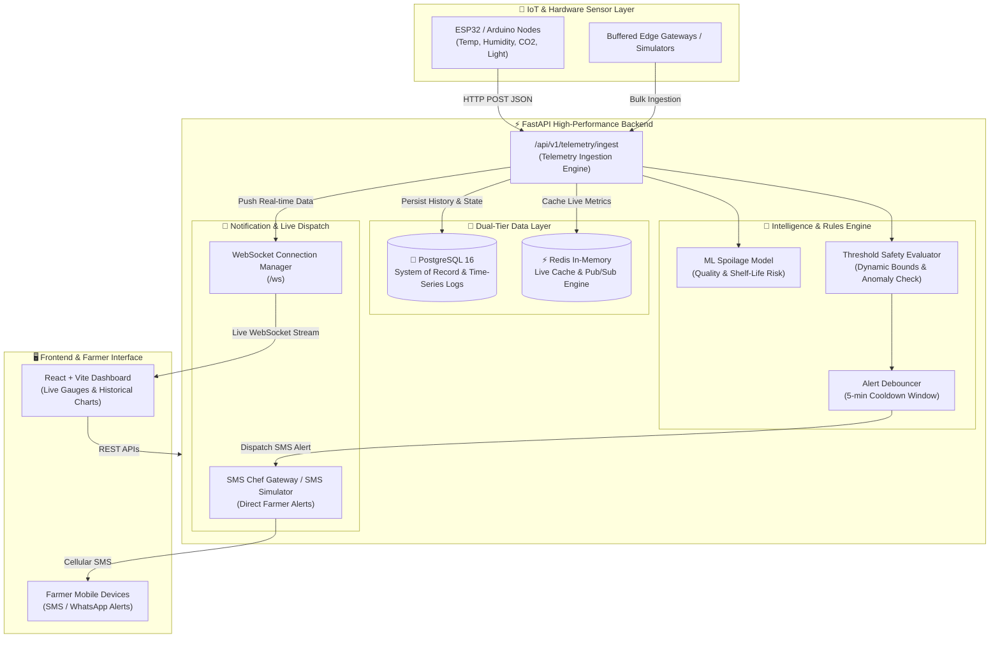

# 🌾 Krishi Cold Chain — IoT Cold Storage Monitoring & Spoilage Prediction System

An end-to-end, IoT-enabled smart cold storage monitoring platform designed to minimize post-harvest agricultural losses. The system continuously tracks ambient conditions across storage chambers, predicts produce spoilage risks using Machine Learning, delivers instant SMS alerts to farmers during environmental anomalies, and streams live telemetry to interactive web dashboards.

---

## 📐 System Architecture



---

## 🌟 Key Features

1. **Multi-Chamber / Multi-Crop Monitoring**:
   - Pre-configured support for various produce types (Orange, Banana, Tomato, Pineapple) with crop-specific threshold boundaries (Temperature, Humidity, $\text{CO}_2$, Light).

2. **Machine Learning Spoilage Prediction**:
   - Real-time assessment of produce health status (`Good` vs. `Bad`), continuous spoilage risk score percentage ($0-100\%$), and actionable environmental mitigation recommendations (e.g. adjust refrigeration setpoints, activate ventilation scrubbers).

3. **Autonomous Farmer Alerting & SMS Gateway**:
   - Automatically detects threshold breaches and dispatches instant SMS alerts to assigned farmers via the **SMS Chef Gateway** (utilizing an Android phone SIM card) or fallback console simulation.
   - Built-in **alert debouncing** prevents alert flooding during prolonged temperature spikes.

4. **Dual-Tier High-Performance Storage**:
   - **PostgreSQL 16**: Relational system of record for cold storage facilities, zones, sensors, farmer produce batches, alerts, and historical time-series telemetry logs.
   - **Redis**: Sub-millisecond caching of live chamber states and Pub/Sub event broadcasting for instant reads under heavy traffic.

5. **Live Real-Time WebSockets**:
   - Bi-directional WebSocket endpoint (`/ws`) pushing real-time sensor updates to frontend charts without requiring manual browser polling.

---

## 🗂️ Project Structure

```
Hackathon_2026/
├── backend/
│   ├── app/
│   │   ├── api/
│   │   │   ├── v1/
│   │   │   │   ├── alerts.py        # Active & historical alert endpoints
│   │   │   │   ├── analytics.py     # Crop health & spoilage distribution analytics
│   │   │   │   ├── api_router.py    # Master v1 router aggregator
│   │   │   │   ├── dashboard.py    # Summary metrics & live zone status
│   │   │   │   ├── farmers.py      # Farmer profiles & produce inventory
│   │   │   │   ├── sensors.py      # Sensor configurations & metadata
│   │   │   │   ├── telemetry.py    # IoT hardware ingestion endpoints
│   │   │   │   └── zones.py        # Cold storage chambers & thresholds
│   │   │   └── websocket.py        # Real-time WebSocket connection handler
│   │   ├── core/
│   │   │   ├── config.py           # Application settings & environment parsing
│   │   │   └── websocket_manager.py# Active WebSocket connection broker
│   │   ├── db/
│   │   │   ├── database.py         # SQLAlchemy async engine & sessionmaker
│   │   │   └── init_db.py          # Database table creation & initial seed data
│   │   ├── models/                 # SQLAlchemy ORM Models
│   │   │   ├── alert.py            # Alert & AlertNotification models
│   │   │   ├── cold_storage.py     # ColdStorage & Zone models
│   │   │   ├── crop_batch.py       # CropBatch inventory model
│   │   │   ├── sensor.py           # Sensor hardware model
│   │   │   ├── telemetry.py        # SensorTelemetryLog time-series model
│   │   │   └── user.py             # Farmer / Operator User model
│   │   ├── schemas/                # Pydantic validation schemas
│   │   ├── services/
│   │   │   ├── alert_service.py    # Threshold checking & debounce logic
│   │   │   ├── cache_service.py    # Redis cache & Pub/Sub integration
│   │   │   ├── ml_service.py       # Spoilage prediction & risk analysis
│   │   │   ├── smschef_service.py  # SMS Chef cellular gateway client
│   │   │   └── telemetry_service.py# Telemetry ingestion orchestrator
│   │   └── main.py                 # FastAPI application root & lifespan hooks
│   ├── test_backend.py             # Complete backend verification suite
│   ├── requirements.txt            # Python dependencies
│   └── .env                        # Environment configuration
├── src/                            # React + Vite Frontend Application
├── package.json                    # Frontend dependencies & scripts
├── vite.config.js                  # Vite bundler configuration
└── README.md                       # Master documentation
```

---

## 🔌 API Reference

FastAPI provides interactive Swagger UI documentation at **`http://localhost:8000/docs`** and ReDoc at **`http://localhost:8000/redoc`**.

### Core Endpoints:

| Category | Method | Endpoint | Description |
| :--- | :---: | :--- | :--- |
| **System** | `GET` | `/health` | Application health check |
| **System** | `GET` | `/docs` | Interactive Swagger UI API documentation |
| **IoT Ingestion** | `POST` | `/api/v1/telemetry/ingest` | Ingest live sensor packet from IoT node |
| **IoT Ingestion** | `POST` | `/api/v1/telemetry/bulk` | Ingest batch telemetry from buffered gateway |
| **Dashboard** | `GET` | `/api/v1/dashboard/summary` | Facility overview metrics (produce, alerts, health) |
| **Dashboard** | `GET` | `/api/v1/dashboard/zones/{id}/live` | Live chamber sensor state + ML risk score |
| **Dashboard** | `GET` | `/api/v1/dashboard/zones/{id}/history` | Historical time-series telemetry for charts |
| **Chambers** | `GET` | `/api/v1/zones` | List all storage zones and safe thresholds |
| **Chambers** | `GET` | `/api/v1/zones/{id}` | Get specific zone configuration |
| **Alerts** | `GET` | `/api/v1/alerts/active` | List all active unacknowledged anomalies |
| **Alerts** | `GET` | `/api/v1/alerts/history` | List historical alert events |
| **Alerts** | `PATCH` | `/api/v1/alerts/{id}/acknowledge`| Acknowledge or resolve an active alert |
| **Farmers** | `GET` | `/api/v1/farmers` | List all registered farmers |
| **Farmers** | `GET` | `/api/v1/farmers/{id}/batches` | Get produce batches stored by a farmer |
| **Streaming** | `WS` | `/ws` | Real-time bi-directional telemetry broadcast |

---

## 📡 Connecting Real IoT Hardware

Microcontrollers (ESP32, ESP8266, Arduino, Raspberry Pi) can post live sensor telemetry over Wi-Fi directly to the backend.

### JSON Payload:
```json
{
  "zone_name": "Zone A - Citrus Chamber",
  "crop_type": "Orange",
  "temperature": 22.5,
  "humidity": 91.0,
  "co2": 320.0,
  "light": 8.5
}
```

---

## 🚀 Quick Start Guide

### 1. Prerequisites
- **Python 3.11+**
- **Docker & Docker Compose** (for PostgreSQL & Redis)
- **Node.js 18+** (for frontend)

---

### 2. Database & Redis Setup (via Docker)
Start the PostgreSQL and Redis containers:

```bash
# In your Docker environment (Linux / WSL / Desktop):
docker compose up -d

# Verify containers are running:
docker compose ps
```

---

### 3. Backend Setup

1. **Activate Virtual Environment**:
   ```powershell
   # Windows:
   .\.venv\Scripts\Activate.ps1
   ```

2. **Configure Environment Variables (`backend/.env`)**:
   ```env
   # PostgreSQL Connection (Note: URL-encode special characters in password e.g. @ -> %40)
   DATABASE_URL=postgresql+asyncpg://postgres:Password@IP:PORT/name_of_db

   # Redis In-Memory Cache
   REDIS_URL=redis://IP:port/0
   ENABLE_REDIS=true

   # SMS Chef Cellular Gateway (Optional - logs to console if empty)
   SMSCHEF_API_URL=https://www.cloud.smschef.com/api/send/sms
   SMSCHEF_API_KEY=your_smschef_key
   SMSCHEF_DEVICE_ID=your_device_id
   SMSCHEF_SIM_SLOT=1
   ```

3. **Verify Full Backend Pipeline**:
   ```powershell
   python backend/test_backend.py
   ```

4. **Start the FastAPI Server**:
   ```powershell
   cd backend
   python -m uvicorn app.main:app --reload --port 8000
   ```

---

### 4. Frontend Setup

1. **Install Dependencies**:
   ```bash
   npm install
   ```

2. **Start Vite Development Server**:
   ```bash
   npm run dev
   ```
   Open **`http://localhost:5173`** to access the web application.

---

## 🛡️ Anomaly Detection & Crop Threshold Rules

| Chamber / Zone | Produce | Min / Max Temp | Safe Humidity | Max $\text{CO}_2$ | Max Light |
| :--- | :--- | :---: | :---: | :---: | :---: |
| **Zone A** | Orange | $21.0^\circ\text{C} - 23.5^\circ\text{C}$ | $85.0\% - 95.0\%$ | $380\text{ ppm}$ | $12.0\text{ Lux}$ |
| **Zone B** | Banana | $24.0^\circ\text{C} - 26.5^\circ\text{C}$ | $85.0\% - 95.0\%$ | $360\text{ ppm}$ | $22.0\text{ Lux}$ |
| **Zone C** | Tomato | $22.0^\circ\text{C} - 24.5^\circ\text{C}$ | $75.0\% - 93.0\%$ | $360\text{ ppm}$ | $18.0\text{ Lux}$ |
| **Zone D** | Pineapple | $22.0^\circ\text{C} - 24.5^\circ\text{C}$ | $80.0\% - 95.0\%$ | $380\text{ ppm}$ | $14.5\text{ Lux}$ |
